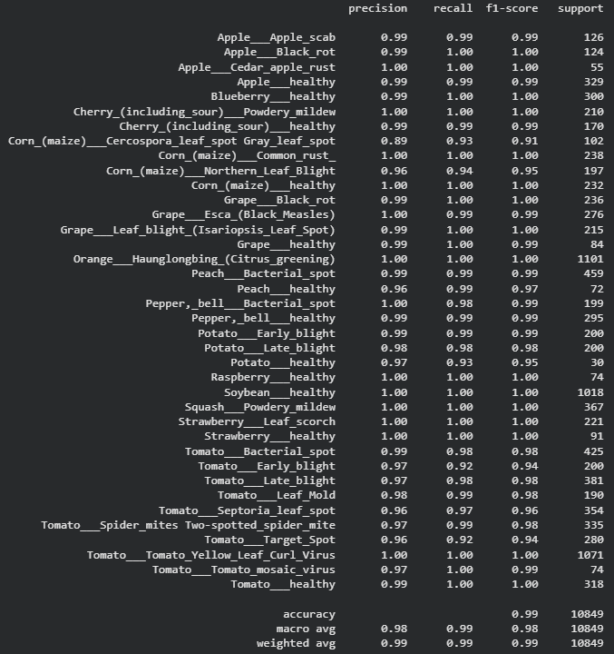
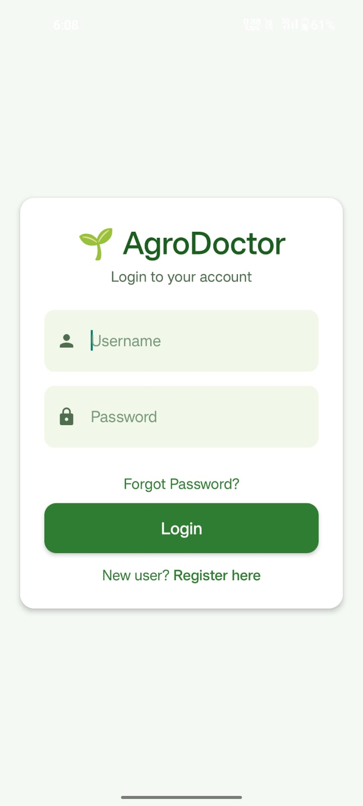
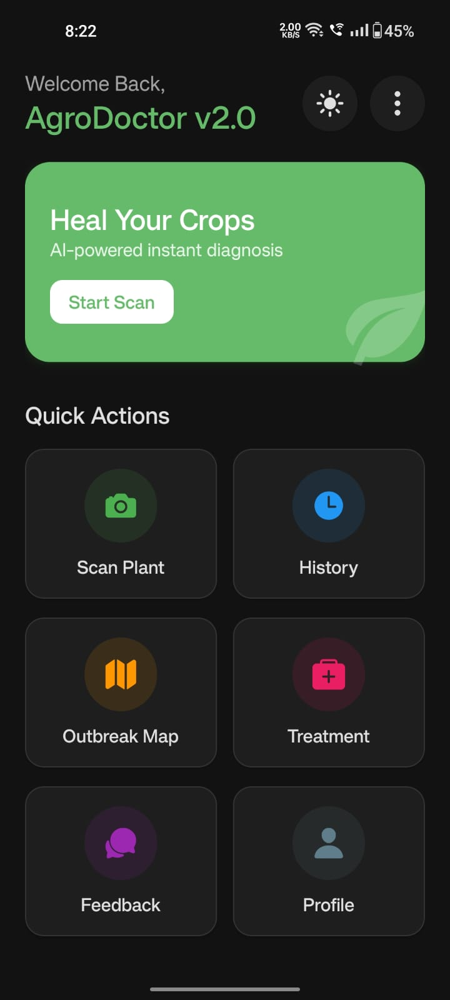
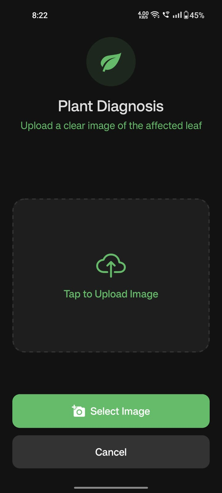
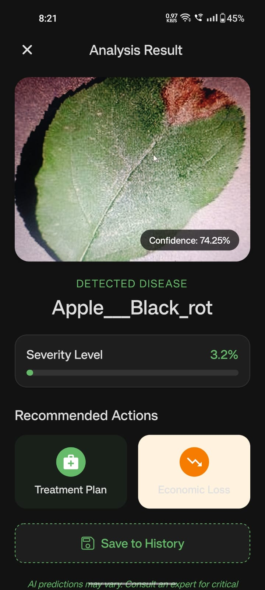
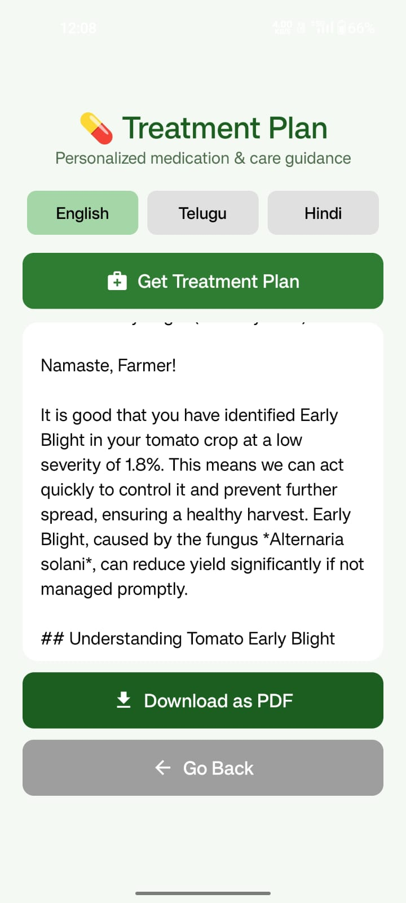
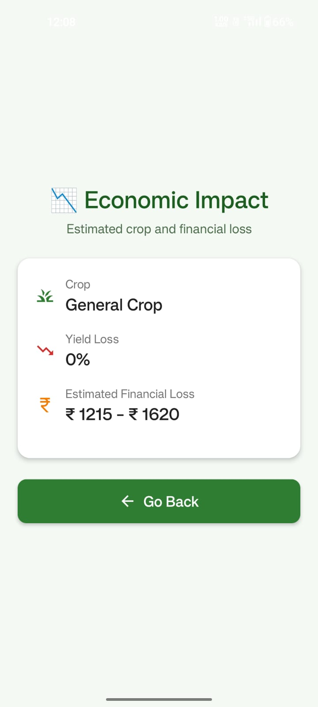
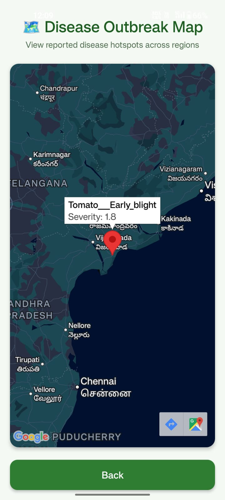
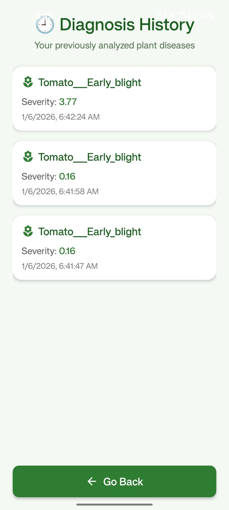
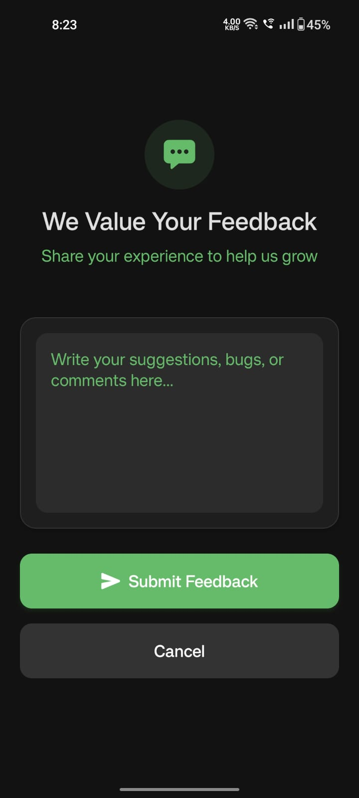

# 🌱 AgroDoctor – AI-Powered Plant Health & Advisory System

**AgroDoctor** is a full-stack **AI-powered mobile ecosystem** designed to empower farmers with instant plant disease diagnosis, severity estimation, and multilingual treatment plans.

Built with **React Native (Expo)**, **FastAPI**, and **Deep Learning (EfficientNetV2)**, it bridges the gap between complex agricultural science and accessible mobile technology, specifically addressing challenges like low bandwidth and limited expert access.

---

## ❓ Problem Statement

Small and marginal farmers often lack timely access to agricultural experts, 
leading to delayed disease diagnosis, improper pesticide usage, and severe yield loss.
AgroDoctor addresses this gap by providing instant, AI-driven plant disease diagnosis 
and treatment recommendations directly through a low-bandwidth mobile application.

---
## 📌 Key Features

### 🧠 Core AI Services
- **📷 Instant AI Diagnosis:** Utilizes a lightweight **EfficientNetV2B0** model (97.96% accuracy) to detect **38 diseases** across 14 plant species from leaf images.
- **📉 Precision Severity Quantification:** Employs **HSV Color Segmentation** algorithms to calculate the exact percentage of leaf tissue damage.
- **🤖 GenAI Advisory:** Integrates **Google Gemini 2.5 Flash** to generate dynamic, context-aware treatment plans rather than static text.
- **💰 Economic Impact Estimator:** An algorithmic module that calculates potential **yield loss** and **financial impact (INR)** based on current market rates and disease severity.
---
### 📱 User Experience & Tools
- **🗣️ Multilingual Support:** Provides treatment advice and interface support in **English, Telugu, and Hindi** to assist diverse farming communities.
- **🗺️ Live Outbreak Mapping:** Visualizes reported disease hotspots on an interactive map using the **Google Maps SDK** to track regional spread.
- **📂 Diagnosis History:** Automatically saves and retrieves past scan results (disease, severity, location, timestamp) for long-term crop monitoring.
- **📄 PDF Report Downloads:** Allows farmers to download comprehensive treatment plans and diagnosis reports as portable PDF documents.
- **📝 Feedback System:** Integrated mechanism for users to submit feedback on diagnosis accuracy and app experience.
- **🔐 Secure Authentication:** Implements robust **JWT-based OAuth2** authentication for secure user registration and data privacy.

---

## 🧠 Model Performance

We evaluated multiple architectures on the **PlantVillage** dataset (54k+ images). **EfficientNetV2B0** was selected for its superior parameter efficiency and accuracy.
Dataset: PlantVillage (38 classes, 54k+ images) 
source: https://www.kaggle.com/datasets/abdallahalidev/plantvillage-dataset

| Model | Validation Accuracy | Validation Loss |
|-------|---------------------|-----------------|
| **EfficientNetV2B0 (Proposed)** | **97.96%** | **0.0679** |
| ResNet50V2 | 96.00% | 0.1176 |
| Custom CNN | 90.76% | 0.2755 |

> **Optimization Note:** The original model weights were ~220-250MB. Converting to **TensorFlow Lite (.tflite)** reduced the file size to **12.5 MB**, mitigating "Cold Start" latency on serverless platforms.

---
## 📊 Model Evaluation & Results
This section presents the quantitative evaluation of the proposed EfficientNetV2B0 model along with real-world application results observed in the AgroDoctor mobile app.
### 🔍 Confusion Matrix

The confusion matrix below illustrates the classification performance of the **EfficientNetV2B0** model across all 38 plant disease classes.


### 📈 Classification Report (Summary)

| Metric | Score |
|------|------|
| Accuracy | 97.96% |
| Precision (Weighted) | 97.8% |
| Recall (Weighted) | 97.9% |
| F1-score (Weighted) | 97.85% |

<details>
<summary>📄 View Full Classification Report</summary>



</details>

**Result Interpretation:**  
The model demonstrates strong generalization across multiple crop classes, with minimal confusion among visually similar diseases. These results validate its suitability for real-time mobile-based plant disease diagnosis.

<details>
<summary><strong>📱 Application Screenshots</strong></summary>

<p align="center">
  
  
</p>

<p align="center">
  
  
</p>

<p align="center">
  
  
</p>

<p align="center">
  
  
</p>

<p align="center">
  
</p>

</details>

---

## 🔄 Application Workflow

1. Farmer captures or uploads a leaf image
2. FastAPI backend performs disease classification
3. Severity is calculated using HSV segmentation
4. Gemini generates a personalized treatment plan
5. Economic impact is estimated and displayed
6. Results are stored for history & outbreak mapping

---
## 🏗️ System Architecture

The system follows a split-stack client-server architecture:

1.  **Frontend:** React Native (Expo) for Android/iOS.
2.  **Backend:** FastAPI (Python) for asynchronous inference and logic.
3.  **Database:** NeonDB (Serverless PostgreSQL) for storing user logs and outbreak data.
4.  **AI Services:**
    * **Diagnosis:** EfficientNetV2B0 (TFLite)
    * **Advisory:** Google Gemini 2.5 Flash API
    * **Severity:** OpenCV (HSV Segmentation)
<p align="center">
  
</p>
---

## 📁 Project Structure

```bash
AgroDoctor/
│
├── plant_disease_backend/
│ ├── app/
│ │ ├── __init__.py
│ │ ├── auth.py
│ │ ├── database.py
│ │ ├── schemas.py
│ │ ├── prediction_service.py
│ │ ├── severity_service.py
│ │ ├── treatment_service.py
│ │ └── economic_service.py
│ │
│ ├── models/
│ │ └── plant_disease_model.tflite  #EfficientNetV2B0 model
│ │ └── class_indices.json
│ │
│ ├── notebooks/
│ │ │ ├── EfficientNetV2B0.ipynb
│ │ │ ├── ResNet50V2.ipynb
│ │ │ └── CNN.ipynb
│ │
│ ├── main.py
│ ├── requirements.txt
│ └── .env
│
│ 
├── plant_disease_frontend/
│ ├── app/
│ │ ├── services/
│ │ │ ├── api.ts 
│ │ ├── _layout.tsx
│ │ ├── index.tsx
│ │ ├── profile.tsx
│ │ ├── upload.tsx
│ │ ├── result.tsx
│ │ ├── treatment.tsx
│ │ ├── impact.tsx
│ │ ├── outbreak.tsx
│ │ ├── history.tsx
│ │ ├── login.tsx
│ │ ├── register.tsx
│ │ ├── forgot-password.tsx
│ │ ├── reset-password.tsx
│ │ ├── feedback.tsx
│ │ └── about.tsx
│ │
│ ├── assets/
│ ├── app.json
│ └── package.json
│ └── package-lock.json
│
│
└── README.md

```

---

## ⚙️ Setup & Installation

### 1️⃣ Backend Setup (FastAPI)

### Prerequisites
- Python 3.9+
- Virtual Environment

### Create Virtual Environment
```bash
cd plant_disease_backend

# Create Virtual Environment
python -m venv venv
# Windows:
venv\Scripts\activate
# Mac/Linux:
source venv/bin/activate

# Install Dependencies
pip install -r requirements.txt

# Create .env file
# GOOGLE_API_KEY=your_gemini_key
# DATABASE_URL=your_neondb_url

# Run Server
uvicorn main:app --reload
```

- Backend runs at: http://127.0.0.1:8000
- API Documentation: http://127.0.0.1:8000/docs


### 2️⃣ Frontend Setup (React Native)

### Prerequisites
- Node.js (18+ recommended)
- Expo CLI

```bash
cd plant_disease_frontend
npm install

# Start the App
npx expo start
```
- Scan QR code using Expo Go (Android).

### 📦 Build APK (Android)
```bash
#Install EAS CLI
npm install -g eas-cli

#Login to Expo
npx eas login

#Configure EAS
npx eas build:configure

#Build APK
npx eas build -p android --profile preview
```
- Expo will generate a downloadable APK link.

---
## 🌍 Deployment Details
| Component | Deployment                   |
| --------- | -----------------------------|
| Backend   | Render (Free Tier)           |
| Frontend  | Expo / Android APK           |
| Database  | NeonDB (Serverless Postgres) |
| Model     | Loaded via FastAPI backend   |

---
## 👨‍💻 Developed By
- Arja Raghuveer
- AI & Machine Learning Undergraduate | Final Year Project

## 📜 License
This project is intended for academic and educational use.
